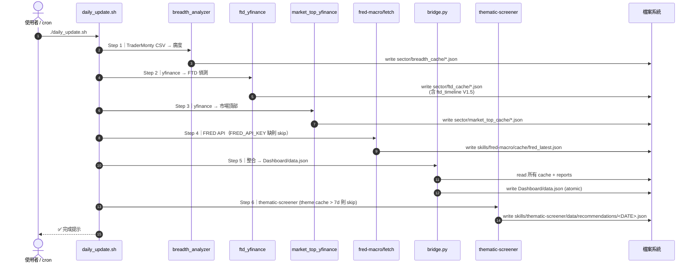
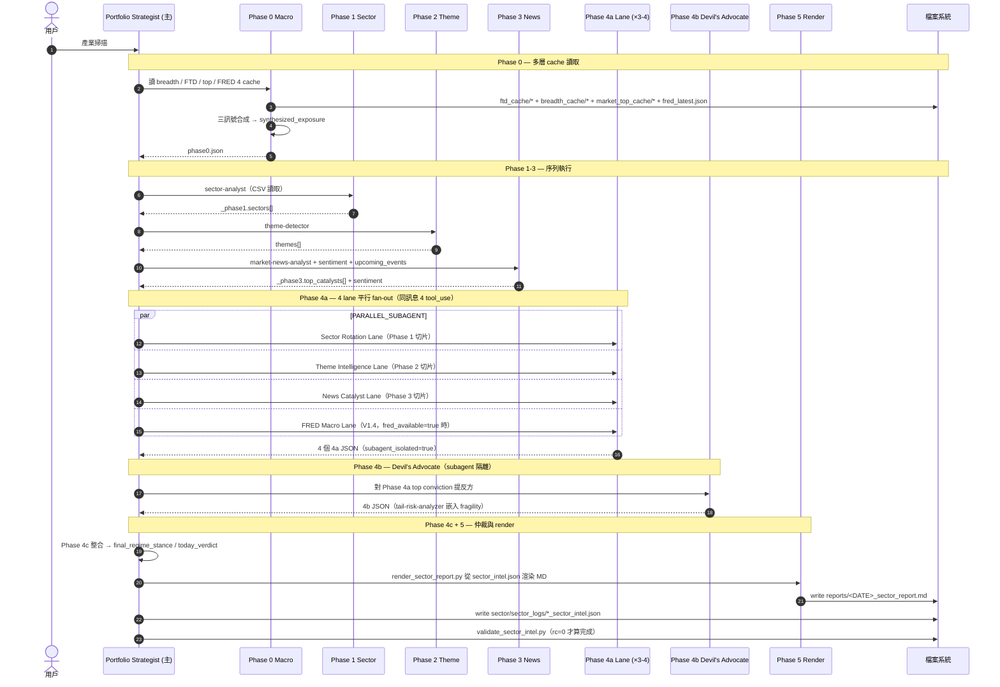
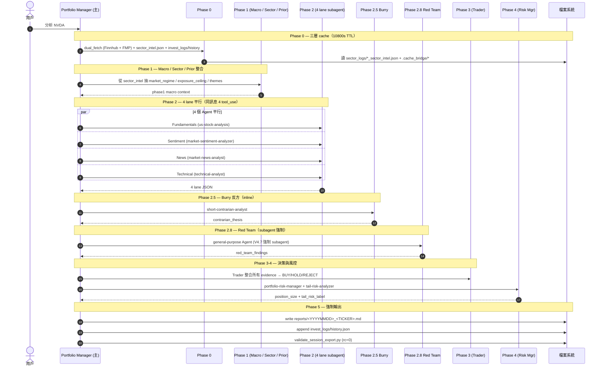
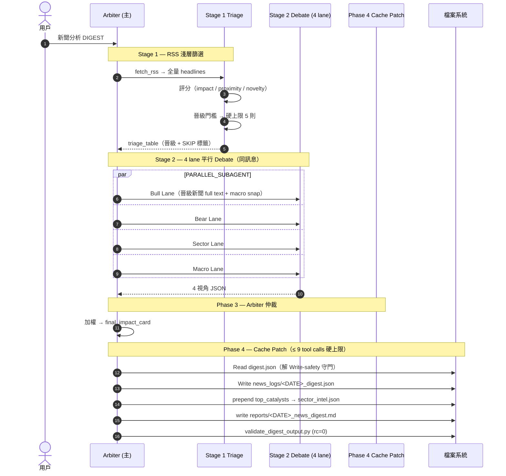

# AI 投資委員會 — 系統架構與 Call Stack

> **目的**：用 4 個視角解一個問題：「資料是從哪來的、被誰呼叫、什麼時候算、寫到哪、最後給誰看」。
>
> 視角分工：
> - **A. 系統地圖** — 一張全景，快速建立 mental model
> - **B. Tier 1 每日自動管線** — `daily_update.sh` 的時序
> - **C. Tier 2 Protocol Call Stack** — 三大 protocol（Sector / Investment / News）內部 phase + subagent fan-out
> - **D. Bridge 聚合 + Cache 目錄 + Skill 依賴** — 資料落地與互呼

---

## 0. TL;DR — 三類觸發點（先看這個）

| 觸發類別 | 入口 | 何時跑 | 主要產出 | 何處可看到 |
|---|---|---|---|---|
| **Tier 1 自動** | `./daily_update.sh`（cron / 手動）| 每日 1 次（盤前/盤後）| `Dashboard/data.json` + 各 cache + thematic recs | Dashboard 全頁 |
| **Tier 2 委員會 protocol** | 對話輸入 `產業掃描` / `分析 X` / `新聞分析` | 用戶觸發 ad-hoc | `reports/*.md` + `*_intel.json` | `reports/`, Dashboard 對應頁 |
| **Tier 3 戰術 / 工具** | `python3 ...predict.py` / `動能 X` / `動能選股` | ad-hoc / 週末 | 短期目標 / 動能分數 / weekly review | `reports/SHORT_TERM_*.md`, momentum cache |

**重要紀律**：Tier 3 戰術層**不影響** investment_protocol 決策。`weights.yaml` 由 user 手動 edit；`weekly_review.py` 永不自動覆寫 config。

---

## A. 系統地圖（取代原本的單張平鋪 DAG）

```mermaid
flowchart LR
    %% ═══════ 觸發點（區分顏色） ═══════
    T_CRON([📅 daily_update.sh<br/>每日自動]):::trigger
    T_USER([👤 用戶輸入<br/>產業掃描 / 分析 X / 新聞]):::userTrigger
    T_TOOL([🛠️ 手動工具<br/>predict.py / 動能 X]):::tool

    %% ═══════ L1 外部資料源 ═══════
    subgraph L1[🌐 L1 — External Data Sources]
        direction TB
        API_YF[yfinance]
        API_FMP[FMP API]
        API_FRED[FRED API]
        API_FINN[Finnhub API]
        API_CSV[TraderMonty CSV]
        API_CNN[CNN Fear&Greed]
        API_RSS[RSS Feeds]
    end

    %% ═══════ L2 量化腳本 ═══════
    subgraph L2[⚙️ L2 — Quantitative Scripts]
        direction TB
        PY_BREADTH[market_breadth_analyzer.py]
        PY_FTD[ftd_yfinance.py]
        PY_TOP[market_top_yfinance.py]
        PY_FRED[fred-macro/fetch.py]
        PY_THEMA[thematic-screener/screen.py]
        PY_MOM[momentum-monitor/momentum.py]
        PY_PRED[short-term-target/predict.py]
        PY_DUAL[finnhub-client/dual_fetch]
        PY_RSS[news/scripts/fetch_rss.py]
    end

    %% ═══════ L3 Skills (LLM 邏輯包) ═══════
    subgraph L3[🧠 L3 — AI Skills (專家邏輯)]
        direction TB
        SK_SECT[sector-analyst]
        SK_TECH[technical-analyst]
        SK_FUND[us-stock-analysis]
        SK_NEWS[market-news-analyst]
        SK_SENT[market-sentiment-analyzer]
        SK_BURRY[short-contrarian-analyst]
        SK_RISK[portfolio-risk-manager]
        SK_TAIL[tail-risk-analyzer]
        SK_THEME[theme-detector]
        SK_VAL[earnings-valuation-forecaster]
        SK_SC[supply-chain-event-analyst]
    end

    %% ═══════ L4 Protocol (Claude 多 Agent 辯論) ═══════
    subgraph L4[🏛️ L4 — Protocols (Multi-Agent Debate)]
        direction TB
        P_SEC[Sector Protocol V1.4<br/>Phase 0→1→2→3→4→5]
        P_INV[Investment Protocol V4.8<br/>Phase 0→1→2→2.5→2.8→3→4→5]
        P_NWS[News Protocol V2.1<br/>Triage→Debate→Arbiter→Patch]
    end

    %% ═══════ L5 整合層 ═══════
    BRIDGE[/🔗 bridge.py<br/>原子寫 data.json/]:::bridge

    %% ═══════ L6 前端 ═══════
    subgraph L6[🖥️ L6 — Dashboard UI]
        direction TB
        UI_INDEX[index.html 總覽]
        UI_SECT[sector.html]
        UI_DEC[decisions.html]
        UI_MOM[momentum.html]
        UI_RADAR[radar.html 短期]
        UI_NEWS[news.html]
        UI_CAL[calendar.html]
    end

    %% ═══════ 觸發路徑（粗線） ═══════
    T_CRON ==> PY_BREADTH & PY_FTD & PY_TOP & PY_FRED & PY_THEMA
    T_USER ==> P_SEC & P_INV & P_NWS
    T_TOOL ==> PY_MOM & PY_PRED & PY_DUAL

    %% ═══════ L1→L2 ═══════
    API_CSV --> PY_BREADTH
    API_YF --> PY_FTD & PY_TOP & PY_MOM & PY_PRED
    API_FRED --> PY_FRED
    API_FMP --> PY_THEMA & PY_DUAL
    API_FINN --> PY_DUAL
    API_RSS --> PY_RSS
    API_CNN --> SK_SENT

    %% ═══════ Skill 被 Protocol 呼叫（虛線） ═══════
    SK_SECT & SK_THEME -.-> P_SEC
    SK_FUND & SK_TECH & SK_NEWS & SK_SENT & SK_BURRY & SK_RISK & SK_TAIL -.-> P_INV
    SK_NEWS -.-> P_NWS

    %% ═══════ L2→bridge / Protocol→bridge ═══════
    PY_BREADTH & PY_FTD & PY_TOP & PY_FRED & PY_THEMA & PY_MOM --> BRIDGE
    P_SEC & P_INV & P_NWS --> BRIDGE

    %% ═══════ bridge→UI ═══════
    BRIDGE ==> UI_INDEX & UI_SECT & UI_DEC & UI_MOM & UI_RADAR & UI_NEWS & UI_CAL

    %% ═══════ 樣式 ═══════
    classDef trigger fill:#1e88e5,color:#fff,stroke:#0d47a1,stroke-width:2px
    classDef userTrigger fill:#43a047,color:#fff,stroke:#1b5e20,stroke-width:2px
    classDef tool fill:#fb8c00,color:#fff,stroke:#e65100,stroke-width:2px
    classDef bridge fill:#8e24aa,color:#fff,stroke:#4a148c,stroke-width:2px
```

**讀圖規則**：
- 🟦 藍色觸發 = 自動跑（cron / 開機跑）
- 🟢 綠色觸發 = 用戶輸入指令觸發 protocol
- 🟧 橘色觸發 = 手動工具，獨立於 protocol
- **粗線（==>）** = 觸發 / 呼叫鏈核心路徑
- **虛線（-.->）** = Skill 被 protocol 內部 Agent 呼叫
- **細線（-->）** = 資料流 / cache 寫入

---

## B. Tier 1 — Daily Auto Pipeline 時序

`./daily_update.sh` 跑下面 6 步，**順序固定**，任一步驟失敗即停（Step 4 / Step 6 例外，非致命可跳過）。



**關鍵時序事實**：
- Step 1-3 平行性：**目前是序列**，未來如要並行可 cut ~30s。
- Step 4 FRED 失敗**不阻斷**後續（warning 印出）。
- Step 6 依賴 `theme-detector` cache（由「產業掃描」產出），cache > 7 天則 skip。

---

## C. Tier 2 — Protocol Call Stack

### C-1. Sector Protocol V1.4（`產業掃描`）



**關鍵紀律**：
- **Phase 0 cache 優先**：3h TTL，FRESH → 跳過 Phase 0-1，從 Phase 2 開始（Phase 3 永遠重新跑）。
- **Phase 4a 隔離**：4 個 subagent 獨立 context，看不到其他 lane 提案，禁止為「與共識一致」調整 conviction。
- **Phase 5 不再由模型寫 MD**（V1.4）：Markdown 由 `render_sector_report.py` 從 JSON 渲染。

---

### C-2. Investment Protocol V4.8（`分析 [TICKER]`）



**關鍵紀律**：
- **Phase 2 必須 4 個 Agent 平行**（同一訊息內 4 tool_use），parent 等 4 個結果都回來才進 Phase 2.5。
- **Red Team 強制 subagent**（V4.7）：禁止 inline 推理代替；`subagent_type: general-purpose`。
- **Non-Interactive 模式**（V4.8）：Dashboard reverse-call (`claude -p`) 觸發時，不向用戶發問、不出摘要表確認。

---

### C-3. News Protocol V2.1（`新聞分析 DIGEST`）



**關鍵紀律**：
- **DIGEST 模式硬規定**：晉級 ≤ 5 則，`timestamp` 必須是今天日期，未重寫 digest.json → validator rc=1 → 禁止輸出 MD。
- **FLASH 模式**：跳過 Triage 直接 Stage 2 Debate（4 agent INLINE，不走 subagent）。
- **REVIEW 模式**：吃 FLASH 的 `prior_flash` 當參考，可推翻但需在 `why_changed` 說明。

---

## D. 資料落地與互呼

### D-1. Bridge 聚合表（`bridge.py` → `Dashboard/data.json`）

| `data.json` 區塊 | 來源 cache / report | 函式 (`bridge.py`) |
|---|---|---|
| `breadth.*` | `sector/breadth_cache/market_breadth_*.json` | `extract_breadth_from_analyzer` |
| `ftd.*`（含 V1.5 `ftd_timeline`） | `sector/ftd_cache/ftd_detector_*.json` | `extract_ftd_data` |
| `market_top.*` | `sector/market_top_cache/market_top_*.json` | `extract_market_top_data` |
| `fred.*` | `skills/fred-macro/cache/fred_latest.json` | `load_fred_snapshot` |
| `sector_intel.*` | `sector/sector_logs/*_sector_intel.json` | `_from_sector_protocol_new` |
| `decisions[]` | `reports/YYYYMMDD_TICKER.md` (frontmatter parse) | `extract_audit_history` |
| `momentum.*` | `skills/momentum-monitor/cache/screen_*.json` | `ingest_momentum_screen` |
| `tactical_recommendations` | `skills/thematic-screener/data/recommendations/<DATE>.json` | `load_tactical_recommendations` |
| `upcoming_events[]` | sector_intel + Fed calendar + FMP econ + FMP earnings 多源 merge | `aggregate_upcoming_events` |
| `news.*` | `news/news_logs/<DATE>_digest.json` | `extract_news` |
| `positions[]` | `data/positions.json` | `load_positions` |

**寫入紀律**：bridge.py 寫 `Dashboard/data.json` 採 **atomic（`.tmp` → `os.replace`）**，避免兩個 protocol 同時結束時 JSON 被讀到半截（BUG-002 修法）。

### D-2. Cache & Report 目錄樹

```
AI投資委員會/
├─ Dashboard/
│  └─ data.json                          ← bridge.py 唯一寫入點 (atomic)
│
├─ sector/                               ← Sector Protocol 領域
│  ├─ breadth_cache/                     ← Step 1 daily
│  ├─ ftd_cache/                         ← Step 2 daily（含 ftd_timeline V1.5）
│  ├─ market_top_cache/                  ← Step 3 daily
│  └─ sector_logs/                       ← 產業掃描完整 JSON 輸出
│
├─ investment/
│  └─ invest_logs/
│     └─ history.json                    ← Phase 5 append 決策紀錄
│
├─ news/
│  └─ news_logs/                         ← News Protocol DIGEST 輸出
│
├─ skills/
│  ├─ fred-macro/cache/fred_latest.json  ← Step 4 daily（1h 自帶 cache）
│  ├─ thematic-screener/data/recommendations/  ← Step 6 daily
│  ├─ theme-detector/cache/              ← 由「產業掃描」 Phase 2 產出
│  ├─ momentum-monitor/cache/            ← 動能 / 動能選股 觸發
│  ├─ short-term-target/config/weights.yaml  ← 用戶手動 edit
│  └─ ...                                ← 其他 skill 各自 cache
│
└─ reports/
   ├─ YYYY-MM-DD_sector_report.md        ← Sector Protocol Phase 5 渲染
   ├─ YYYYMMDD_TICKER.md                 ← Investment Protocol Phase 5
   ├─ YYYY-MM-DD_news_digest.md          ← News Protocol Phase 4
   ├─ SHORT_TERM_WEEKLY_<DATE>.md        ← weekly_review.py 產出（手動週末）
   └─ POSTMORTEM_<DATE>.md               ← backtest_postmortem.py 產出
```

### D-3. Skill 互相 call 誰（核心依賴鏈）

| Protocol Phase | 同訊息平行 Skills | 序列 Skills |
|---|---|---|
| Sector Phase 1-3 | — | sector-analyst → theme-detector → market-news-analyst → market-sentiment-analyzer |
| Sector Phase 4a (×3-4) | rotation lane / theme lane / news lane / **fred lane (V1.4)** | — |
| Sector Phase 4b | tail-risk-analyzer (嵌在 DA) | — |
| Invest Phase 0 | — | finnhub-client/dual_fetch + fred-macro |
| Invest Phase 2 (×4) | us-stock-analysis / market-sentiment-analyzer / market-news-analyst / technical-analyst | — |
| Invest Phase 2.5 | — | short-contrarian-analyst (Burry, inline) |
| Invest Phase 2.8 | — | general-purpose subagent (Red Team, 強制 subagent) |
| Invest Phase 4 | — | portfolio-risk-manager → tail-risk-analyzer |
| News Stage 2 (×4) | bull / bear / sector / macro lane | — |

---

## 各層級簡介（保留原語）

- **L1 External APIs** — 系統地基，價格 / 財務 / 新聞 / 宏觀。
- **L2 Quantitative Scripts** — API 通訊與量化計算（均線 / RSI / 派發日 / 三訊號合成）。
- **L3 AI Skills** — 將 Python 數據封裝為 LLM 可調用的專家邏輯包，含 SKILL.md prompt + scripts。
- **L4 Protocols** — 系統大腦，多 Agent 辯論 + 仲裁 + 強制 validator gate（rc=0 才算完成）。
- **L5 bridge.py** — 唯一可寫 `Dashboard/data.json` 的進程，atomic write 避免半截 JSON。
- **L6 Dashboard UI** — 7 個頁面（index / sector / decisions / momentum / radar / news / calendar），全部讀同一份 `data.json`。

---

## 版本與失敗診斷小抄

| 症狀 | 先看 |
|---|---|
| Dashboard 空白 / 半舊 | 確認 `bridge.py` 是否 atomic 寫入完成；查 `Dashboard/data.json` mtime |
| 產業掃描卡 Phase 4 | Phase 4a 4 lane 是否同訊息 4 tool_use；任何 lane retry 仍失敗 → `PARTIAL_FALLBACK` |
| 個股分析 Red Team 沒跑 | V4.7 強制 subagent，inline 推理 = 違規 |
| `Dashboard/data.json` 半截 | bridge.py atomic write 沒到位（BUG-002 修法回退）|
| FTD day-counter 寫錯 | 引用 `ftd_timeline.ftd_status_text` 原文，**不要**自由命名「FTD Day N」（BUG-006）|
| daily_update.sh Step 4 fail | `FRED_API_KEY` 是否設定；`fetch.py` 對 None 比較是否安全 |
