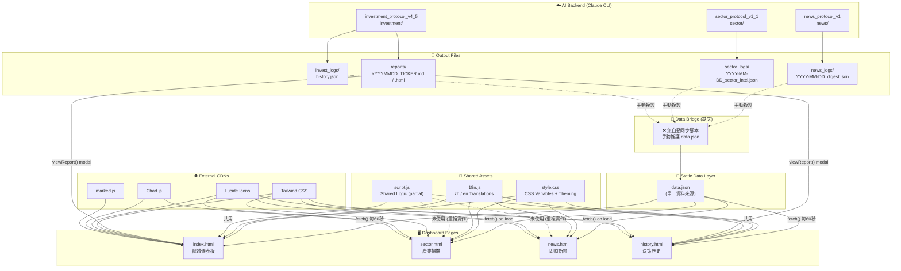

# INTEL COMMAND Dashboard — Architecture Review
> Reviewed: 2026-04-12 | Reviewer: Claude Code

---

## 系統架構圖



---

## 5 大需要改進的地方

### 問題 1：Sidebar HTML 複製貼上 4 次（DRY 違反）

**現況：** `index.html`、`sector.html`、`news.html`、`history.html` 各自包含一份完全相同的 Sidebar HTML（約 45 行）。

**具體問題：**
- `index.html:16-61`、`sector.html:15-60`、`news.html:15-60`、`history.html:15-60` — 四份完全相同的 aside 區塊
- 任何導航變更（新增頁面、改圖示、改品牌名稱）都需要同步修改 4 個檔案
- 實際已發生版本不同步：`index.html` footer 顯示 `V1.1.7`，其他三頁顯示 `V1.1.8`

**建議：** 使用原生 `<web-component>` 或 JS `fetch()` 注入共用模板，或改用 SSG 工具（如 11ty / Vite）進行 partial 包含。最輕量的做法是建立 `sidebar.html` 並用一個 `loadSidebar()` JS 函數動態 inject。

---

### 問題 2：「快速啟動引擎」是純裝飾 UI，完全沒有功能

**現況：** `index.html:175-180` 的 Ticker 輸入欄位與「開始分析」按鈕完全沒有事件綁定。

**具體問題：**
```html
<!-- index.html:175-180 -->
<input type="text" placeholder="輸入美股代碼 (e.g. MSFT)...">
<button>開始分析</button>
```
按鈕點擊後什麼都不發生。這是整個 Dashboard 最核心的互動入口（觸發 Claude 分析），卻是空殼。

**建議：** 實作 `launchAnalysis(ticker)` 函數，至少可以：
1. 打開 Terminal / 顯示 Claude Code 指令（`分析 TICKER`）的 copy 按鈕
2. 或透過本機 API server（如 `python scripts/launch_analysis.py`）觸發分析流程

---

### 問題 3：JS 邏輯分裂 — `script.js` 與行內 `<script>` 重複實作

**現況：** `initTheme()`、`toggleTheme()`、`logToUI()` 在 `script.js` 中定義，但 `sector.html` 和 `news.html` 各自在 `<script>` 標籤中重新實作了一遍。

**具體問題：**
- `logToUI` 在 `script.js:30-38`、`news.html:117-125`、`sector.html:171-175` 各有一份（三份）
- `initTheme` / `toggleTheme` 在 `script.js:5-23`、`news.html:282-296`、`sector.html:346-366` 各有一份
- `news.html` 甚至沒有引用 `script.js`，導致 `viewReport()` 功能無法在新聞頁使用

**建議：** 建立 `core.js`（或升級 `script.js`）成為全站共用的 utility module，包含 `initTheme`、`toggleTheme`、`logToUI`、`applyTranslations` 等共用函數，所有頁面統一引用。

---

### 問題 4：Sector Heatmap 資料完全寫死，忽略 `data.json` 和 `sector_logs/`

**現況：** `sector.html:230-243` 的 12 個產業評分是 hardcoded 靜態數字，與任何實際分析結果完全無關。

**具體問題：**
```javascript
// sector.html:230-243 — 這些數字永遠不會變
const sectors = [
    { id: "SEMICONDUCTORS", score: 85 },
    { id: "TECHNOLOGY", score: 78 },
    { id: "CYBERSECURITY", score: 88 },
    ...
];
```
即使 `sector_protocol_v1_1` 產出了新的 `sector_logs/` JSON，Sector 頁面顯示的依然是這 12 個固定數字。`data.json` 中的 `market.hot_sectors` 也被忽略。

**建議：** `data.json` 應加入 `sector_scores` 欄位，由 `sector_logs/` 的最新 JSON 生成。`sector.html` 改從 `data.json.sector_scores` 讀取，讓 heatmap 反映真實分析結果。

---

### 問題 5：`data.json` 更新流程完全依賴手動，沒有自動同步橋接

**現況：** Dashboard 的唯一資料來源是 `data.json`，但這個檔案沒有任何自動更新機制。「更新快取」按鈕（`index.html:82-85`）只是觸發 `updateDashboard()` 重新讀取同一個 `data.json`，並不向後端寫入或觸發任何分析。

**具體問題：**
- Claude 分析完成 → 寫出 `reports/YYYYMMDD_TICKER.md` + `invest_logs/history.json`
- 但 `data.json` 的 `recent_analysis[]` 陣列需要**人工**複製更新
- 每次分析後都要手動維護 `data.json`，容易遺漏或格式錯誤

**建議：** 建立 `scripts/sync_dashboard.py`，掃描 `invest_logs/history.json` 與 `news_logs/` 最新 JSON，自動重新產生 `data.json`。可在 Claude Code 的 hook（post-analysis）自動觸發，或透過 `更新快取` 按鈕呼叫本機 endpoint 執行。

---

## 改進優先序建議

| 優先級 | 問題 | 影響 | 難度 |
|--------|------|------|------|
| 🔴 P0 | 問題 5：data.json 無自動同步 | 資料完全過時，Dashboard 失去價值 | 中 |
| 🔴 P0 | 問題 4：Sector 資料寫死 | Sector 頁面顯示虛假資料 | 低 |
| 🟠 P1 | 問題 2：啟動引擎無功能 | 核心互動入口是空殼 | 中 |
| 🟡 P2 | 問題 3：JS 邏輯重複 | 維護負擔，bug 修一處不會同步 | 中 |
| 🟢 P3 | 問題 1：Sidebar 複製貼上 | 品牌更新需改 4 處 | 低 |
