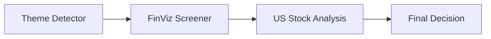

# ⏺ Theme Detector 投資主題偵測器

> **核心價值**：透過 6 步驟量化 + 敘事確認 Pipeline，準確定位市場資金流向，避免追高殺低。

---

## 🚀 運作流程 (6-Step Pipeline)

### Step 1 — 產業資料收集
掃描 **FINVIZ** 約 145 個產業，全面抓取核心指標：
- **動能指標**：多時間框架績效（1W / 1M / 3M）
- **量能變化**：成交量（vs 歷史均量）
- **個股健康度**：RSI、52 週高低價位、上升趨勢比例 (Uptrend Ratio)

> [!NOTE]
> **效能對比**：
> - **公開模式**：每產業 ~20 支股票，速度 5-8 分鐘（含 2 秒 Rate Limit）
> - **Elite 模式**：完整股票宇宙掃描，僅需 ~2-3 分鐘

---

### Step 2 — 主題分類與映射
依據 `cross_sector_themes.md` 定義，將 145 個產業映射至 **14+ 跨行業主題**（如：AI、Clean Energy、Cybersecurity 等）。
*   *規則*：每個主題需達到「最低產業匹配數量」才會被啟動分析。

---

### Step 3 — Heat Score 計算 (0-100)
由四個子指標加權合成熱度：

| 子指標 | 衡量內容 |
| :--- | :--- |
| **Momentum Strength** | 多時間框架加權績效 |
| **Volume Intensity** | 當前成交量 vs 歷史均量 |
| **Uptrend Ratio** | 主題內股票處於技術上升趨勢的比例 |
| **Breadth** | 方向一致的產業參與率（產業層級） |

---

### Step 4 — Lifecycle 評估
計算主題的「擁擠程度」，判斷當前處於何種循環：

| 階段 | 特徵描述 |
| :--- | :--- |
| 🌱 **Emerging** | 參與者少、相關 ETF 尚未普及，具備高潛力 |
| 📈 **Accelerating** | ETF 開始發行、分析師報告量激增 |
| 🔥 **Trending** | 市場主流題材、新聞廣泛覆蓋 |
| ⚠️ **Mature** | 市場高度共識、估值普遍偏高 |
| 🚫 **Exhausting** | ETF 氾濫、極端估值、反向指標出現 |

---

### Step 5 — 方向性判斷 (Directional Logic)
將 145 個產業依動能排名：
- **上半部**：判定為 Bullish
- **下半部**：判定為 Bearish
*   *機制*：採「多數決」決定主題方向（顯示為 `LEAD` 或 `LAG`）。

---

### Step 6 — 敘事確認 (Narrative Review)
對排名前 5 的主題，由 Claude 執行 **WebSearch**，確認量化信號是否與新聞/分析師觀點一致。

> [!TIP]
> ** Confidence 評級規則**：
> - **Medium**：僅依靠 Python 腳本分析。
> - **High**：通過 Claude WebSearch 交叉驗證。

---

## 💡 決策與判讀 (The Golden Combination)

| 組合 | 判讀意義 | 建議行動 |
| :--- | :--- | :--- |
| **High Heat + Emerging** | 最佳進場機會 | 強勢且尚未擁擠，積極佈局 |
| **High Heat + Exhausting** | 頂部警戒 | 強勢但反轉風險極高，準備撤退 |

---

## 🛠️ 系統整合 (Edge Pipeline)

Theme Detector 是交易系統中最重要的 **Top-down 過濾器**：

主題確認後，再往下鑽研個股，確保選股方向與市場「大錢」的流動性完全一致。
